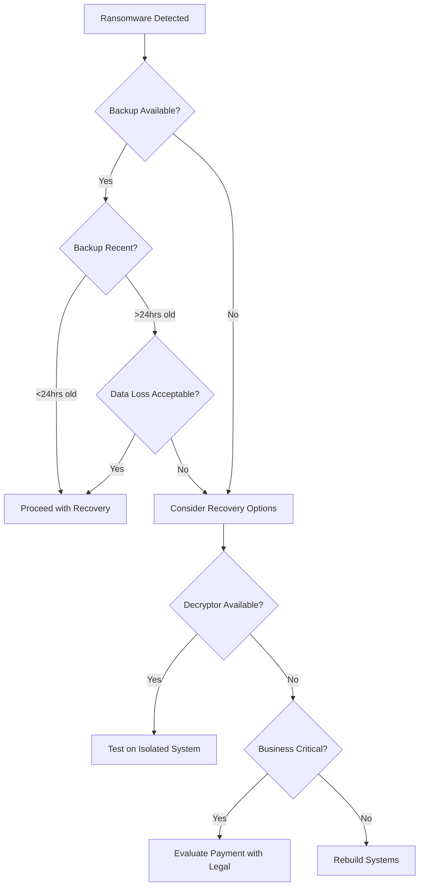

# Incident Response Playbook Templates - Actual Content Examples

## 📄 Ready-to-Use Template Content

---

## 1. RANSOMWARE PLAYBOOK TEMPLATE

### Detection Phase
```yaml
ransomware_detection:
  indicators:
    technical:
      - "Files renamed with extensions: .locked, .crypto, .enc, .encrypted"
      - "Presence of HELP_DECRYPT, README, or HOW_TO_DECRYPT files"
      - "Volume Shadow Copies deleted (vssadmin delete shadows)"
      - "Unusual network traffic to C2 servers"
      - "High CPU usage from unknown processes"
      - "Registry modifications to disable recovery"
    
    user_reports:
      - "Cannot open files that previously worked"
      - "Desktop wallpaper changed to ransom message"
      - "Programs failing to launch"
      - "Shared drives inaccessible"
  
  validation_steps:
    - "Check file headers - encrypted files lose normal headers"
    - "Attempt to open files from multiple directories"
    - "Verify backup systems are not affected"
    - "Check for lateral movement indicators"
```

### Containment Procedures
```markdown
## IMMEDIATE CONTAINMENT (0-15 minutes)

### Network Isolation
1. **Disconnect ethernet cables** from affected systems
2. **Disable WiFi** at the system level (not just disconnect)
3. **Block at switch level** if remote management available:
   ```
   interface [PORT]
   shutdown
   ```
4. **Implement network segmentation**:
   - VLAN isolation for affected segment
   - ACL rules to block lateral movement

### Preserve Evidence
**DO:**
- Take photos of ransom messages with phone/camera
- Export Windows Event Logs:
  ```powershell
  wevtutil epl System C:\Evidence\system.evtx
  wevtutil epl Security C:\Evidence\security.evtx
  wevtutil epl Application C:\Evidence\application.evtx
  ```
- Capture running processes: `tasklist > C:\Evidence\processes.txt`
- Save network connections: `netstat -ano > C:\Evidence\connections.txt`

**DO NOT:**
- Power off systems (destroys memory evidence)
- Run antivirus scans (may delete evidence)
- Pay ransom without legal/executive approval
```

### Decision Tree


---

## 2. DATA BREACH PLAYBOOK TEMPLATE

### Initial Assessment Checklist
```markdown
## DATA BREACH INITIAL ASSESSMENT FORM

**Incident ID:** BR-[YYYY-MM-DD-###]
**Date/Time Discovered:** _______________
**Reported By:** _______________

### 1. WHAT - Data Classification
- [ ] Personally Identifiable Information (PII)
  - [ ] Names
  - [ ] Social Security Numbers
  - [ ] Driver's License Numbers
  - [ ] Email addresses
  - [ ] Phone numbers
  - [ ] Physical addresses
  
- [ ] Financial Information
  - [ ] Credit/Debit card numbers
  - [ ] Bank account information
  - [ ] Financial records
  
- [ ] Health Information (PHI)
  - [ ] Medical records
  - [ ] Insurance information
  - [ ] Prescription data
  
- [ ] Authentication Data
  - [ ] Passwords (hashed/plain)
  - [ ] Security questions
  - [ ] Multi-factor tokens

### 2. HOW MANY - Scope Assessment
- Number of records affected: _______________
- Number of individuals affected: _______________
- Geographic distribution:
  - [ ] Single state: _______________
  - [ ] Multiple states (list): _______________
  - [ ] International (list countries): _______________

### 3. WHEN - Timeline
- Earliest evidence of compromise: _______________
- Latest confirmed activity: _______________
- Discovery date: _______________
- Containment date: _______________

### 4. HOW - Attack Vector
- [ ] External attack (hacking)
- [ ] Malware/ransomware
- [ ] Insider threat (malicious)
- [ ] Insider error (accidental)
- [ ] Physical theft
- [ ] Third-party breach
- [ ] Lost device/media
- [ ] Misconfiguration
- [ ] Unknown
```

### Regulatory Notification Matrix
```markdown
## BREACH NOTIFICATION REQUIREMENTS

| Regulation | Timeline | Threshold | Who to Notify | Format |
|------------|----------|-----------|---------------|---------|
| **GDPR** | 72 hours | Any personal data + risk to rights | Supervisory Authority | Online form |
| **GDPR** | Without undue delay | High risk to individuals | Data subjects | Clear, plain language |
| **CCPA** | Without unreasonable delay | >500 CA residents | CA Attorney General | Online submission |
| **CCPA** | Without unreasonable delay | Any CA resident | Affected consumers | Mail or email |
| **HIPAA** | 60 days | Any PHI | Affected individuals | Written notice |
| **HIPAA** | 60 days | >500 individuals | HHS OCR | Online portal |
| **HIPAA** | 60 days | >500 in state/region | Media outlets | Press release |
| **NY SHIELD** | Without unreasonable delay | Any NY resident | NY Attorney General | Online form |
| **NY SHIELD** | Most expedient time | Any NY resident | Affected residents | Written notice |
```

### Sample Notification Letter
```markdown
[COMPANY LETTERHEAD]

[Date]

Dear [Customer Name],

**NOTICE OF DATA BREACH**

We are writing to inform you of a data security incident that may have affected your personal information. We take the protection of your information seriously and are providing this notice so you can take steps to protect yourself.

**What Happened?**
On [date], we discovered unauthorized access to our [system type] that occurred between [date] and [date]. We immediately launched an investigation with the assistance of external cybersecurity experts and notified law enforcement.

**What Information Was Involved?**
The information that may have been accessed includes:
- Your name
- [List specific data types affected]

**What We Are Doing**
We have taken the following actions:
- Secured the affected systems
- Reset all user passwords
- Implemented additional security measures
- Engaged forensic investigators
- Notified appropriate regulators

**What You Should Do**
We recommend you take the following precautionary measures:
1. Review your account statements for any suspicious activity
2. Place a fraud alert with credit bureaus:
   - Equifax: 1-800-525-6285
   - Experian: 1-888-397-3742
   - TransUnion: 1-800-680-7289
3. Consider placing a security freeze on your credit files

**For More Information**
We have established a dedicated call center at [phone] available [hours].

We sincerely apologize for any inconvenience this may cause.

Sincerely,
[Name]
[Title]
```

---

## 3. DDOS PLAYBOOK TEMPLATE

### Attack Classification
```yaml
ddos_classification:
  volume_based:
    - "UDP floods"
    - "ICMP floods"
    - "Spoofed packet floods"
    indicators:
      - "Bandwidth saturation"
      - "Upstream ISP alerts"
      - ">10Gbps traffic spike"
    
  protocol_attacks:
    - "SYN floods"
    - "Fragmented packet attacks"
    - "Smurf DDoS"
    indicators:
      - "High connection state tables"
      - "Firewall/load balancer overload"
      - "Slow network performance"
    
  application_layer:
    - "HTTP floods"
    - "Slowloris"
    - "DNS query floods"
    indicators:
      - "Web server resource exhaustion"
      - "Database connection pool exhaustion"
      - "Specific URL patterns targeted"
```

### Response Procedures
```markdown
## DDOS RESPONSE RUNBOOK

### LEVEL 1: Initial Detection (0-5 minutes)
**Triggered by:** Monitoring alerts, user reports, ISP notification

1. **Verify Attack**
   ```bash
   # Check current traffic
   netstat -an | grep :80 | wc -l
   
   # Check bandwidth usage
   iftop -i eth0
   
   # Check server load
   top -bn1 | head -5
   ```

2. **Identify Attack Type**
   - Application layer: Check web server logs
   - Network layer: Check netflow/packet captures
   - DNS: Check resolver logs

### LEVEL 2: Mitigation (5-30 minutes)
**Escalate if:** Attack >1Gbps or critical services affected

1. **Enable DDoS Protection**
   - Cloudflare: Enable "Under Attack" mode
   - AWS: Enable Shield Advanced
   - Akamai: Activate DDoS mitigation

2. **Rate Limiting**
   ```nginx
   # Nginx rate limiting
   limit_req_zone $binary_remote_addr zone=one:10m rate=10r/s;
   limit_req zone=one burst=20 nodelay;
   ```

3. **Geographic Filtering** (if applicable)
   - Block countries not in customer base
   - Implement at CDN/WAF level

### LEVEL 3: Advanced Response (30+ minutes)
**Escalate to:** ISP/Hosting provider, DDoS mitigation service

1. **Contact ISP for upstream filtering**
2. **Implement BGP blackholing if available**
3. **Activate scrubbing center redirect**
```

---

## 4. COMMUNICATION TEMPLATES

### Internal Status Update
```markdown
**Subject:** [SEVERITY] Incident Status Update - [INCIDENT_ID]

**Current Status:** [Active/Contained/Resolved]
**Time Since Detection:** [Duration]
**Services Affected:** [List]
**Customer Impact:** [None/Minimal/Moderate/Severe]

**Summary:**
[2-3 sentences on current situation]

**Actions Taken:**
- [Completed action 1]
- [Completed action 2]
- [In progress action]

**Next Steps:**
- [Planned action 1] - ETA: [time]
- [Planned action 2] - ETA: [time]

**Resource Needs:**
[Any additional resources required]

**Next Update:** [Time]

**Incident Commander:** [Name] - [Phone]
```

### Executive Briefing
```markdown
## EXECUTIVE INCIDENT BRIEF

**Classification:** [CONFIDENTIAL]
**Date/Time:** [Current]
**Incident Type:** [Ransomware/Breach/DDoS/etc]

### BUSINESS IMPACT
- **Revenue Impact:** $[amount] per hour downtime
- **Customers Affected:** [number]
- **Regulatory Risk:** [GDPR/CCPA/HIPAA] notification required
- **Reputation Risk:** [Low/Medium/High]

### KEY DECISIONS NEEDED
1. **Authorize external IR firm?** Cost: $[amount]
2. **Notify law enforcement?** May delay recovery
3. **Public communication?** PR team recommendation: [Yes/No]

### CURRENT RESPONSE
- Incident team activated at [time]
- [Primary mitigation action] completed
- Recovery ETA: [timeframe]

### RECOMMENDATIONS
1. [Primary recommendation]
2. [Secondary recommendation]

**Prepared by:** [CISO/Security Manager]
**Contact:** [Phone] (24/7 incident line)
```

---

## 5. ESCALATION MATRIX TEMPLATE

```yaml
escalation_matrix:
  severity_levels:
    critical:
      definition: "Complete service outage or data breach >10K records"
      notification_time: "Immediate"
      contacts:
        - "On-call Security Lead"
        - "CISO"
        - "CEO"
        - "Legal Counsel"
        - "PR Team"
      
    high:
      definition: "Partial outage or data breach <10K records"
      notification_time: "Within 30 minutes"
      contacts:
        - "Security Manager"
        - "IT Director"
        - "Legal (if data breach)"
      
    medium:
      definition: "Limited impact, single system affected"
      notification_time: "Within 2 hours"
      contacts:
        - "Security Team"
        - "System Owner"
      
    low:
      definition: "No customer impact, contained incident"
      notification_time: "Next business day"
      contacts:
        - "Security Team"

  time_based_escalation:
    - trigger: "Incident unresolved after 2 hours"
      action: "Escalate one severity level"
    - trigger: "Customer data exposed"
      action: "Immediate escalation to Critical"
    - trigger: "Media inquiry received"
      action: "Notify PR team immediately"
    - trigger: "Law enforcement contact"
      action: "Notify Legal and CEO immediately"
```

---

## 6. POST-INCIDENT TEMPLATE

### Lessons Learned Meeting Agenda
```markdown
## POST-INCIDENT REVIEW MEETING

**Date:** [Date + 5 business days from resolution]
**Duration:** 90 minutes
**Required Attendees:** Incident team, stakeholders, management

### AGENDA

1. **Timeline Review (20 min)**
   - When was incident detected vs. when it began?
   - Key decision points and delays
   - Time to containment/resolution

2. **What Went Well (15 min)**
   - Effective responses
   - Good decisions
   - Team coordination successes

3. **What Needs Improvement (30 min)**
   - Detection gaps
   - Response delays  
   - Communication issues
   - Tool/process failures

4. **Root Cause Analysis (15 min)**
   - Technical root cause
   - Process failures
   - Contributing factors

5. **Action Items (10 min)**
   - Assign owners
   - Set deadlines
   - Define success metrics

### DELIVERABLES
- Updated playbook sections
- New detection rules
- Process improvements
- Training needs
```

---

## 🔧 Integration Code

### Template Loader
```python
class TemplateManager:
    def __init__(self):
        self.templates = {}
        self.load_all_templates()
    
    def load_all_templates(self):
        """Load all YAML/MD templates into memory"""
        template_dir = Path('templates')
        
        # Load scenario templates
        for scenario_file in template_dir.glob('scenarios/*/*.yaml'):
            scenario = scenario_file.parent.name
            with open(scenario_file) as f:
                self.templates[scenario] = yaml.safe_load(f)
        
        # Load communication templates  
        for comm_file in template_dir.glob('communications/*/*.md'):
            comm_type = f"{comm_file.parent.parent.name}_{comm_file.stem}"
            self.templates[comm_type] = comm_file.read_text()
    
    def get_template(self, template_name, variables=None):
        """Retrieve and populate template with variables"""
        template = self.templates.get(template_name)
        if variables:
            template = self.populate_variables(template, variables)
        return template
```

---

## 📁 Complete Skill Package

Your final skill package would include:
```
incident-response-playbook-creator/
├── SKILL.md (skill documentation)
├── README.md (installation/usage)
├── templates/ (all templates above)
├── scripts/ (generator code)
├── examples/ (sample outputs)
└── tests/ (validation tests)
```

This provides **actual, usable content** extracted from authoritative sources that can be directly incorporated into your skill!